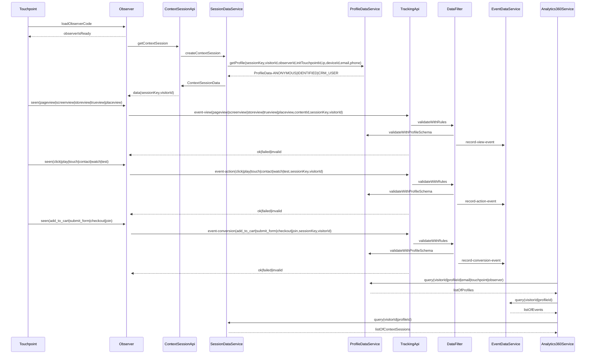

```mermaid
sequenceDiagram
    Touchpoint->>+Observer: loadObserverCode
    Observer-->>Touchpoint: observerIsReady
    Observer->>+ContextSessionApi: getContextSession
    ContextSessionApi->>+SessionDataService: createContextSession
    SessionDataService->>+ProfileDataService: getProfile(sessionKey,visitorId,observerId,initTouchpointId,ip,deviceId,email,phone)
    ProfileDataService-->>SessionDataService: ProfileData-ANONYMOUS|IDENTIFIED|CRM_USER
    SessionDataService->>+ContextSessionApi: ContextSessionData
    ContextSessionApi-->>Observer: data(sessionKey,visitorId)
    Touchpoint->>+Observer:seen(pageview|screenview|storeview|trueview|placeview)
    Observer->>+TrackingApi: event-view(pageview|screenview|storeview|trueview|placeview,contentId,sessionKey,visitorId)
    TrackingApi->>+DataFilter:validateWithRules
    DataFilter->>+ProfileDataService:validateWithProfileSchema
    DataFilter->>+EventDataService: record-view-event
    TrackingApi-->>Observer: ok|failed|invalid
    Touchpoint->>+Observer: seen(click|play|touch|contact|watch|test)
    Observer->>+TrackingApi: event-action(click|play|touch|contact|watch|test,sessionKey,visitorId)
    TrackingApi->>+DataFilter:validateWithRules
    DataFilter->>+ProfileDataService:validateWithProfileSchema
    DataFilter->>+EventDataService: record-action-event
    TrackingApi-->>Observer: ok|failed|invalid
    Touchpoint->>+Observer: seen(add_to_cart|submit_form|checkout|join)
    Observer->>+TrackingApi: event-conversion(add_to_cart|submit_form|checkout|join,sessionKey,visitorId)
    TrackingApi->>+DataFilter:validateWithRules
    DataFilter->>+ProfileDataService:validateWithProfileSchema
    DataFilter->>+EventDataService: record-conversion-event
    TrackingApi-->>Observer: ok|failed|invalid
    Analytics360Service->>+ProfileDataService:query(visitorId|profileId|email|touchpoint|observer)
    ProfileDataService-->>Analytics360Service:listOfProfiles
    Analytics360Service->>+EventDataService:query(visitorId|profileId)
    EventDataService-->>Analytics360Service:listOfEvents
    Analytics360Service->>+SessionDataService:query(visitorId|profileId)
    SessionDataService-->>Analytics360Service:listOfContextSessions
```
