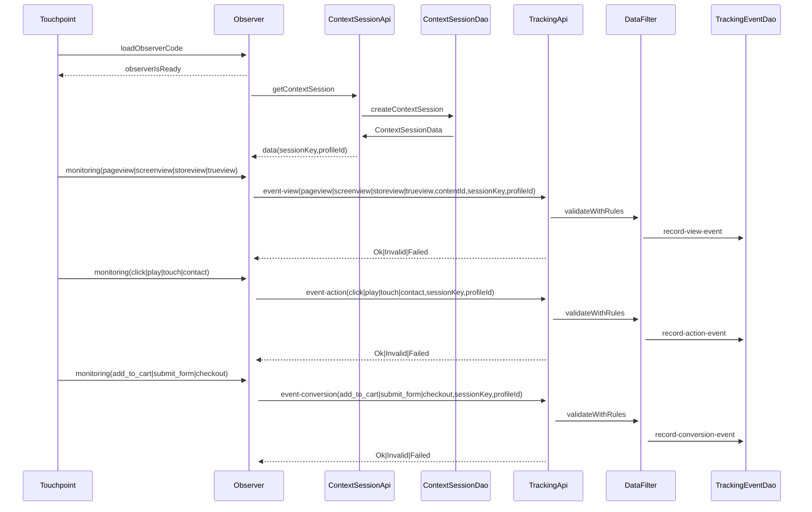

```mermaid
sequenceDiagram
    Touchpoint->>+Observer: loadObserverCode
    Observer-->>Touchpoint: observerIsReady
    Observer->>+ContextSessionApi: getContextSession
    ContextSessionApi->>+ContextSessionDao: createContextSession
    ContextSessionDao->>+ContextSessionApi: ContextSessionData
    ContextSessionApi-->>Observer: data(sessionKey,profileId)
    Touchpoint->>+Observer:monitoring(pageview|screenview|storeview|trueview)
    Observer->>+TrackingApi: event-view(pageview|screenview|storeview|trueview,contentId,sessionKey,profileId)
    TrackingApi->>+DataFilter:validateWithRules
    DataFilter->>+TrackingEventDao: record-view-event
    TrackingApi-->>Observer: Ok|Invalid|Failed
    Touchpoint->>+Observer: monitoring(click|play|touch|contact)
    Observer->>+TrackingApi: event-action(click|play|touch|contact,sessionKey,profileId)
    TrackingApi->>+DataFilter:validateWithRules
    DataFilter->>+TrackingEventDao: record-action-event
    TrackingApi-->>Observer: Ok|Invalid|Failed
    Touchpoint->>+Observer: monitoring(add_to_cart|submit_form|checkout)
    Observer->>+TrackingApi: event-conversion(add_to_cart|submit_form|checkout,sessionKey,profileId)
    TrackingApi->>+DataFilter:validateWithRules
    DataFilter->>+TrackingEventDao: record-conversion-event
    TrackingApi-->>Observer: Ok|Invalid|Failed
```
